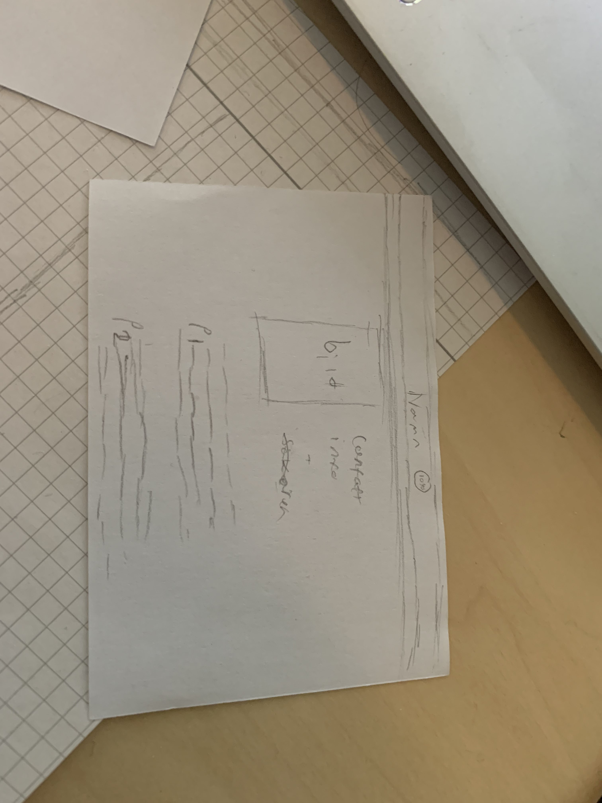

# CV för fiktiva karaktär
Edwin Holgersson Olovsson, 2021-11-18
## Inledning
Målet med denna uppgiften är att programmera en sida för en frivillig fiktiv karaktär. Detta kommer göras med hjälp av HTML och CSS. Vi började med att skriva ett CV på engelska lektioner. Sedan kommer vi ska en logotyp i Adobe Illustrator för karaktären (som en SVG fil). Sedan programmera vi i HTML sidan. 
## Bakgrund
Vi började med att välja våran fiktiva karaktär. Efter vi hade valt våran karaktär började vi med att skriva ett CV till den valda karaktären. Efter det var klart började vi brainstorma ideer på hur logan till karaktären skulle kunna se ut. Efter vi hade hittat en design vi var nöjda med började vi att skapa logotypen i Adobe Illustrator. 

Sedan började vi skissa möjliga layouts till våran sida vi gjorde detta på papper och fick ca 5min på per skiss där vi sedan skulle välja den vi tyckte var bäst. I totalt blev det typ 3 olika desigen men alla var en variation från denna.

(Bild på skissen som van.)
Denna design tog vi sedan och skapade en digital mall av med hjälp att program som kallas för figma(https://www.figma.com/file/HDulLIsdYBQ6YPSKbeFlBr/cv?node-id=0%3A1). Detta gjordes för att få en idé på hur slut produkten skulle se ut och det är enklar för att få en bild på hur slut produkten kommer ser ut. 
 
Efter allt detta var klart började vi att programmera sidan i HTML och CSS där vi skulle använda den tidgara gjorde figma designen till en faktiskt hemsida. När allt detta var klart skulle vi presentera vad vi har gjort för en grupp på 5-6 personer.

## Positiva erfarenheter 
Det viktigaste jag har lärt mig under denna processen är hur man använder display flex. Jag tror detta är  det viktigast för att utan att kunna avända display flex skulle hella sidan gå sönder. Samt display flex är någonting jag kommer använda många gånger i framtiden och utan att kunna använda display flex skulle man inte bra kunna ha två element brevid varandra. 

Samt har jag lärt mig mer om klasser och hur man kan göra att en klass gör något och en annan gör någoting helt annat.

Jag har även lärt mig hur man kan centrera en hel del objekt till t.ex. mitten av skärmen.

Självklart har jag ju också blivit bättre på att använda HTML samt CSS.

Jag har också lärt mig vad att tänka på när man designar något t.ex. contrast, färger och des betydelse m.m.

## Negativa erfarenheter 

Att använda postion. Det var funkade bara 1 ut av 10 gånger. 

d
 
 

